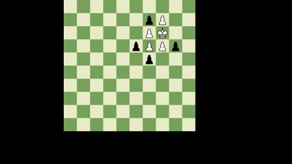

This isn't really a fully developed product or anything, just a project to explore how well a rule-based AI agent can play this game I invented, as well as to determine whether one side is particularly advantageous. It is not meant to provide a pleasant playing experience, rather a framework for building and testing an AI agent. 

This is a turn based strategy board game. It currently has two working themes, the original one being football chess, where you basically have a kick return, or a rushing play, however you want to think of it. The ball carrier (king) is guided by his teammate blockers (white pawns) towards the touchdown (third row from bottom). The defending team (black pawns) try to tackle the ball carrier (king). The second is Secret Service, where the white pieces are secret service agents guiding the president (king) to the white house and defending him from insurrectionists (inspired by real events). I will use the football theme as it is easier to communicate and the metaphors work better. The game is played on a 10x10 board but can be played on a standard chess board in real life. All pieces move the same as a king would in chess, one space any direction. "Tackling" the ball carrier is the same concept as capturing in chess, any black piece simply lands on the ball carrier's space and the game is over. Tackling is unique to the game-ending instance of a defender landing on ball carriers square. All other pieces may move into opponent's squares but the result is simply a push. The opponent occupying the square is pushed back one space in the direction of the push. You may not push two players, so it is illegal to move into an opponents square that has a piece behind it, or that runs off the board. Both Defense and Offense may push each other, but not members of their own team. Pulling is not a thing and does not exist. One other rule inspired by football but also to keep proper game mechanics, is that a defensive player may not tackle the ball carrier by moving diagonally between offensive players. This is partly because defense would be overpowered, but also because it reflects the "pocket" in football where a quarterback is generally safe when surrounded by blockers, and defensive players are not allowed to simply slip in through diagonals. Each player's turn consists of moving every piece on their team once. You are allowed to move any or all pieces to the same spot they are in if you would like, effectively passing a turn for any or all pieces. So during white's turn he will move all his pieces, then black will move all his pieces, and so on. The game continues until the ball carrier is tackled, or the ball carrier reaches the endzone (3rd to bottom rank). 

The big question this project tries to solve, is whether this game, which is inherently asymmetrical in its gameplay, has asymmetrical outcomes as well, and at what level. It is reasonable to assume that there is some level of asymmetry in outcome, because the gameplay is so different from either side. However it is not entirely obvious from the limited anecdotal evidence I have from simply playing with friends. I do suspect that the defensive side is slightly better, at least at the level I play at. The problem is I beat most people from whichever side I play so I don't have good perspective on it. It is perfectly possible that, while I would choose to play defense everytime, players who are far smarter than me or far better at the game, choose offense everytime. Similar to how the scholars mate opening as white may seem overpowered for beginner chess players, but scoffed at by skilled chess players.

Of course there is also the larger question of whether this game can be solved. Given how asymmetrical it is, I do suspect, with current rules, one side does win with perfect gameplay, but thankfully there has been no emergent guaranteed-win tactic from white.

If any subsequent model does solve the game for white or black, or demonstrates that one side is significantly better than the other, it will simply be a matter of tweaking the rules to even it out. This has already happened in earlier trials. The game started with something like 8v8, which then got whittled down to 5v4. If defense is still too good at this level we can try things like 4v3 or 6v4. AI players will help determine which ruleset creates the most balanced game.

Let me discuss how the AI player decides it moves, then we can discuss the questions it has answered. Right now I only have an offensive AI. The AI is very simple. It searches through every possible legal move, then for each move it assigns a score to the resulting game state based on how advantageous it is for white. The first part of this process deserves some attention. Most simple game engines use a minimax algorithm to go through every possible combination of moves by you and your opponent, for as many moves in advance as you have computing power. The limitation here being that the amount of moves to check grows exponentially. In chess for example if you have an average of 20 possible moves per turn, two turns in the future results in 20 * 20 = 400 possible game states to check after 2 moves. After n moves it would be 20^n. In general it would be the amount of legal moves per turn, raised to the number of turns in the future you want to check. So lets first figure out how many possible moves there are for a single turn in this game. This is not as simple as chess, because in this game all 5 pieces are moved in a single same turn. So lets do the math to get an upper limit for the amount of possible moves in a single turn. Each piece can move one step any direction, this is 9 possible steps (including staying put). Because there are five pieces moving each of their 9 possible moves, the total amount of combinations of these moves would be 9^5 = 59,049. But wait, if you've played the game you know that the order in which you move the pieces matters, because moving a piece before another piece often opens up another possible move for it. So we have each possible combination of 5 pieces moving their 9 different ways, but now we need every permutation for those 5 pieces, which would be 5! = 120. So in total the upper limit of moves to check would 9^5 * 5! = 7,085,880 possible moves. This is an upper limit for the amount of possible moves on a turn, the actual average seems to be around 2,000,000 legal moves per turn. However, 7,085,880 is still very relevent because computers don't know what illegal moves are until they check them, meaning this is still the number of moves that must be searched. A branching factor of 2,000,000 makes it impossible to see any more than one move into the future. To simply check all the possible responses to all my possible moves, would mean calculating 4,000,000,000,000 (4 trillion) positions. Not feasible. So this engine only focused on calculating for a single turn. Originally, checking all 7,085,880 moves took 12 minutes for my computer, however after a few key optimizations I was able to get it down to 30 seconds. Firstly I optimized my permutation algorith, which did not run in optimal run time the first time I coded it. Next I made a key change to the algorithm. It originally formulated an entire 5-move turn, then checked for legality, then evaluated the resulting position. This is straightfoward, but it actually misses a huge opportunity for optimzation, because the algorithm is still checking all the possible following combinations of moves involving an initial move which was already illegal. Imagine a first move where a piece tries to run off the board - we don't need to check all of the possible combinations of moves to follow that move. A more efficient algorith keeps track of a temporary board that is checked for legality after each piece's move. If at any point a move is illegal it will not continue that branch of the search. This saved the bulk of time. Another optimzation was to distinguish between deep search and shallow search. I realized backward moves rarely occur during a game, and it is easy to recognize when they might be used. By default the AI does a shallow search which only checks forward and sideways moves for each piece. If you are in the endgame with pieces all over, and it's clear the best move will probably involve a backwards move, you can specify a deep search which takes a couple minutes. 

Lets talk about the AI's strategy. So once each legal move is formulated, it is run through an evaluation function to determine how good the position seems for white. After evaluating all the moves, the move with the most points is chosen. The algorith primarily prioritizes ball carrier safety, as well as any winning moves. If the ball carrier reaches the touchdown on a move, it is ranked highest automatically. Obviously if the ball carrier is tackled the game is over, so if any position allows for the king to be captured on the next move, it will be ranked lowest. Of course we can't actually check all possible next moves because of the branching factor, but it simply checks if any black piece is within one square of the king, and not protected by the diagonal tackling rule. In the absence of these winning and losing conditions, we are basically assigning a score based on how good the position seems. The first highest weighted score is the advancement of the king. If the king has advanced, that position scores some amount of points. Next, points are awarded based on how far opponents are away from the ball carrier. The eucilidean distance is computed for each enemy piece to the king, and the sum is taken and multiplied by a constant, then awarded as a bonus. The more distance the opponents are from the king, the better. Then the euclidean distances from the king to all teammate pieces are calculated, and these are multiplied by a constant and subtracted from the positions score (more distance = bad. This constant is less, as opponent distance matters more than teammate distance. You may be wondering why euclidean distance is chosen, because technically the distance experienced by the pieces on the board is chebyshev distance. Euclidean is actually still better because it reflects that diagonal squares away from the ball carrier are less valuable than the squares directly orthogonal, due to the diagonal tackling rule. You can see in the GIF an example of a pretty standard move from the offensive AI. You can see it is satisfying the max/min total distance of defense/offense while advancing the ball carrier. The overall strategy is largely based off of the intuitive way that humans play this game. We like to keep opponents away from the ball carrier, and blockers close to the ball carrier, all while safely advancing the king. 

The AI tends to perform about as well or slightly better, than a human who is new to the game. However with enough experience, humans tend to beat the AI everytime, although again, this actually isn't too much of a strike on the AI, as all players seem to lose more often with the offense. 

I've played against the AI a lot and I have found that a couple times per game it will make an astounding move that I'm sure I never would have found. It has only beat me a few times though, and I believe it is actually probably better than me, but it is just harder to win as offense. My hope was to make a an offensive AI that was considerably better than me, which did not happen, but again does not mean that the AI is worse than me. The obvious next step is to make a defensive AI with the same evaluation strategy and see if I can beat it as the offense. I may do this someday but as current I'm working on other projects and when I come back to this I plan to make a deep learning model that uses self play. Hopefully that model will be able to outperform me and my AI model on offense. 

Again this isn't really developed in a way that is meant to be played, but if you want to play, just drag and drop the pieces, the program won't let you make illegal moves so don't worry about that. The AI only exists for white, so if you want to play against the AI, just right-click while it is white's turn (make sure you have moved ALL of your pieces, even if you move some to the same spot), and it will make its move in about 30 seconds. For a deep search, use a middle click. Once you have moved a piece, you can't move it again, so don't make mistakes. If you click on a piece and unclick, it will think that you moved the piece to that same spot and you will be unable to move it. If you have clicked a piece and don't want to move it yet, just drag it to some illegal move and it will cancel it for you. If you mess up you can just manually move both teams in the same place for a whole turn and get back to where you messed up. 

